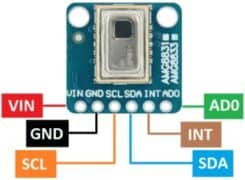
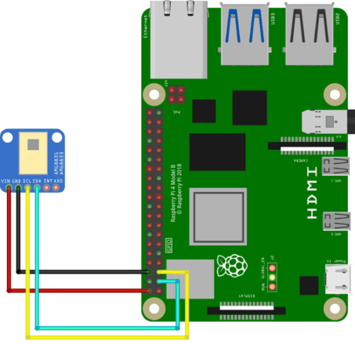

# ThermoSense

# Wiring 

- VIN: Power supply voltage input (2.7V to 3.3V)
- GND: Ground
- SCL: I2C clock line
- SDA: I2C data line
- INT: Interrupt output (active low)
- AD0: I2C address selection pin (low for 0x69, high for 0x68)

